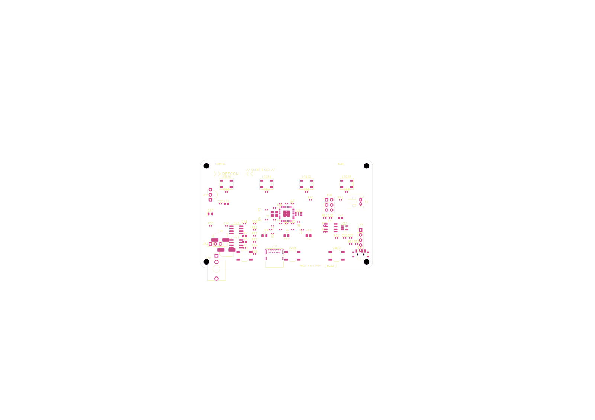
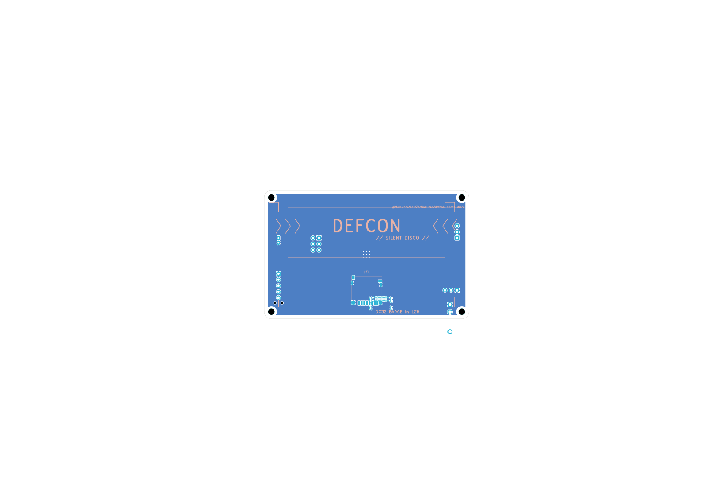

# DEF CON silent disco badge

RP2040-based wearable badge with 4 addressable RGB LEDs, microSD audio
playback, headphone amp, IR receive/transmit, and Shitty Add-On (SAO).
Designed iteratively by an autonomous Claude Code loop (see HARNESS.md).

## Current state

 

**Spec at a glance**
- Form factor: **86 × 54 mm** (ID-1 / credit-card), 3 mm rounded corners
- Stackup: **4-layer** — F.Cu / In1.Cu = GND / In2.Cu = +3V3 / B.Cu = GND pour
- 80 components placed (79 on F.Cu, 1 on B.Cu)
- All footprints resolve from stock KiCad libraries

**Functional subsystems**
- **MCU** RP2040 (U3) + W25Q16 flash (U2) + 12 MHz crystal (Y1) — center
- **Power** USB-C (J10) → TP4056 charger (U10) → JST-PH LiPo (J11) → SS-12D00 switch (SW1) → ME6211C33 LDO (U11) → +3V3 — right edge
- **LEDs** 4× SK9822 RGB addressable (LED20-23) with 10 nF bypass — top edge
- **Audio** TM8211 DAC (U20) → FDA1308 headphone amp (U21) → PJ-320A jack (J20) — bottom-left
- **IR** TSOP4838 receiver (U30) + 940 nm LED (D20) — left edge
- **Buttons** 3× TS-1187A push (SW20-22) — bottom row
- **Connectors** SAO 2×3 (J30), Dev/SWD 1×5 (J33), UART 1×3 (J32), microSD (J31, back)

## Repo layout
```
defcon_badge/             KiCad project (sheets: Audio, IO, LEDs_IR, MCU_Core, Power)
defcon_badge/tools/       Python + bash automation
  render_pcb.sh           SVG/PNG renders to renders/
  move_components.py      Reposition footprints by refdes
  flip_footprint.py       Move a footprint to the back side (proper F.*↔B.* swap)
  set_outline.py          Rewrite Edge.Cuts (rounded rect + optional cutouts)
  place_lib_footprint.py  Add a stdlib footprint to the PCB by name
  sync_nets.py            Sync nets from schematic into PCB
  patch_j10_nets.py       Override J10 USB-C pad nets with the correct UFP map
  check_footprints.py     Verify every footprint reference resolves
fab/                      gerbers/ (regenerable), pos.csv, bom.csv, README.md
docs/                     PCB renders for the README
renders/                  Latest renders (gitignored — run `make render`)
HARNESS.md                The autonomous-loop playbook
PROMPT.md                 The /loop entry prompt
STATE.md                  Rolling iteration state — last 5 iters + open TODO
Makefile                  `make fab`, `make render`, `make drc`, `make erc`, etc.
```

## Build pipeline
```sh
make render    # SVG/PNG renders to renders/
make fab       # refill zones → sync nets → patch J10 → gerbers/drill/pos/BOM
make drc       # design rules check + zone refill
make erc       # ERC summary
make clean     # wipe generated artifacts
```

## Known gaps
- **No copper traces routed.** The board has all components placed, nets
  declared, and GND/+3V3 zones filled, but no signal traces. Routing is
  the user's call: install JRE + run freerouting on the exported DSN, or
  hand-route in KiCad.
- **Schematic has 71 ERC violations** (mostly off-grid endpoints,
  unconnected wire stubs, missing PWR_FLAG markers). The PCB ignores
  these but DRC/parity will complain. None change topology.
- **Schematic J10 USB-C wiring bug.** The codegen wired every CC/VBUS/GND
  pin to a single `/Power/CC2` net. `tools/patch_j10_nets.py` overrides
  this in the PCB with the correct UFP mapping (4× GND, 4× VBUS, 2× CC2,
  2× DP, 2× DM, 4× shield); the schematic still has the bug.

## How this was built
This entire layout pass was produced by an autonomous Claude Code loop
running in `/loop` dynamic mode. Each iteration:
1. Renders the PCB and reads the image.
2. Picks the single highest-value fix.
3. Applies it, commits with `iter(N): <summary>`, updates `STATE.md`.
4. Schedules the next iteration via `ScheduleWakeup`.

See `HARNESS.md` for the playbook and permissions, and `git log` for
the iteration history.
