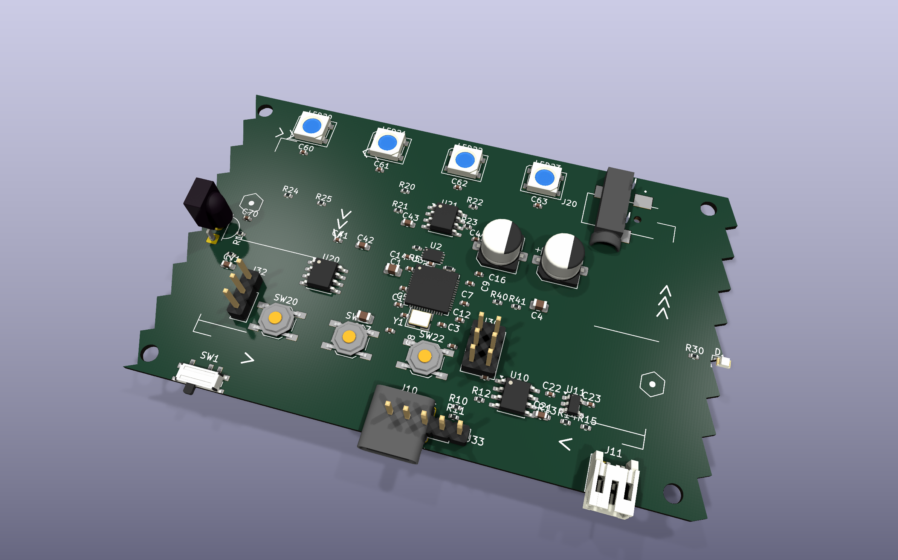
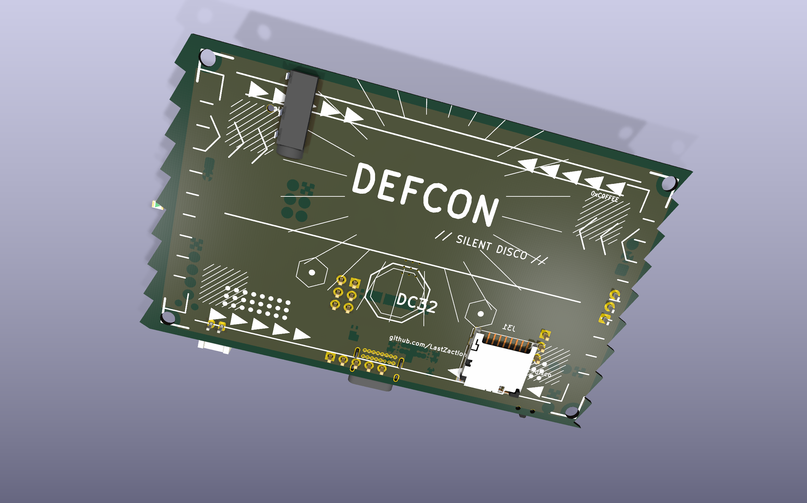
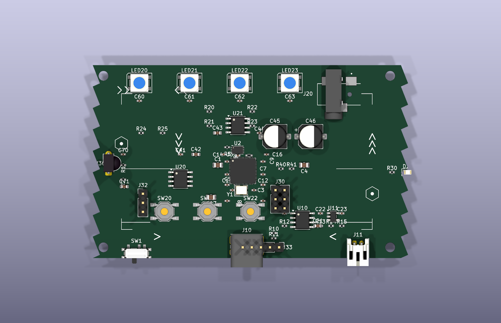
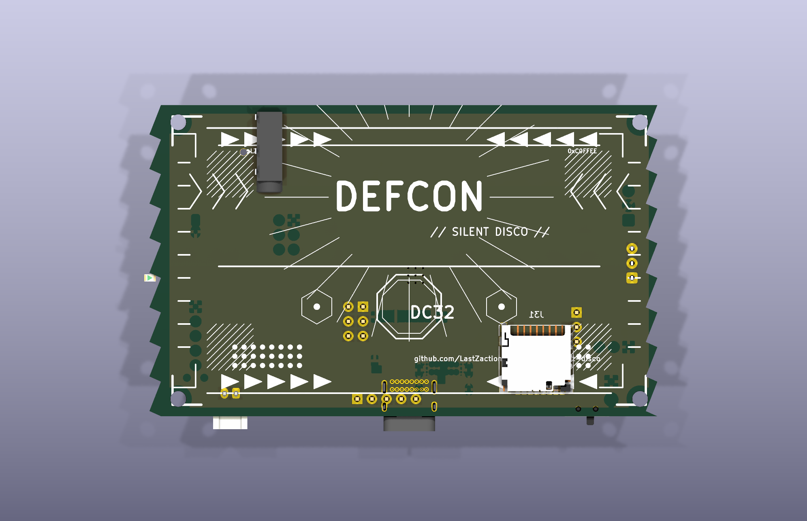
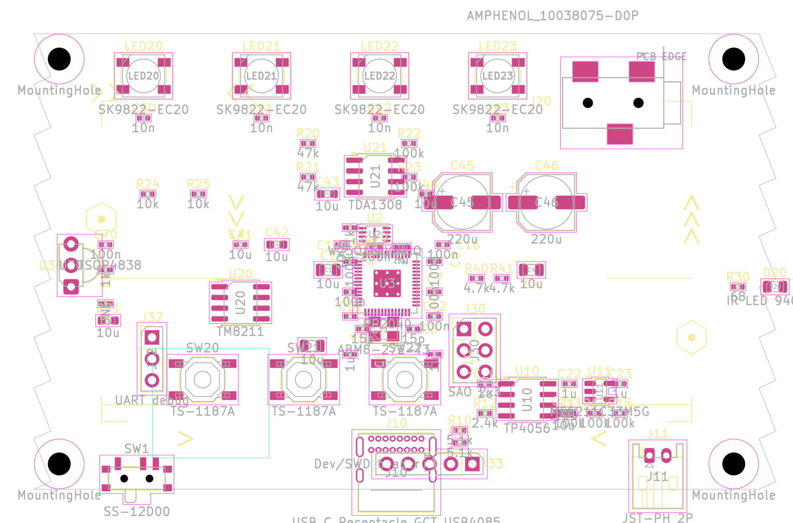

# DEF CON silent disco badge

RP2040-based wearable badge with 4 addressable RGB LEDs, microSD audio
playback, headphone amp, IR receive/transmit, and Shitty Add-On (SAO).
Mecha Tokyo dance party silkscreen aesthetic.
Designed for board-to-board pairing via sawtooth interlocking edges +
3D-printed IR light covers.

## Current state — review on phone

### Iso 3D (the hero shots)





### Straight-on 3D (manufactured look)

| Front | Back |
|---|---|
|  |  |

### 2D plan view (top-down, courtyards visible — design review)



## Spec at a glance
- **Outline:** 86 × 54 mm credit-card form factor, sharp corners
- **Pairing geometry:** Real-sawtooth left + right edges (9 teeth per side, 6mm period, 2mm depth) — A's right teeth slot into B's left notches
- **Stackup:** 4-layer (F.Cu, In1.Cu = GND, In2.Cu = +3V3, B.Cu = GND pour)
- **Components:** 80 placed (79 on F.Cu, 1 on B.Cu microSD)
- **Mounting:** 4× M2.5 holes (2.7mm) at corners
- **Ratsnest length:** 1422.9 mm across 87 nets (excluding GND, which is the inner plane)

## Subsystems
- **MCU:** RP2040 (U3) + W25Q16 flash (U2) + 12 MHz crystal Y1 with 15p load caps + 12-cap decoupling ring (one 100n adjacent to each U3 power pin)
- **Power:** USB-C (J10) → TP4056 charger (U10) → JST-PH LiPo (J11) → SS-12D00 switch (SW1) → ME6211C33 LDO (U11) → +3V3 rail
- **LEDs:** 4× SK9822-EC20 5×5mm RGB addressable across the top edge with 10nF bypass per LED
- **Audio:** TM8211 I²S DAC (U20) → FDA1308 headphone amp (U21) → 220µF AC coupling (C45/C46) → Amphenol 10038075-D0P stereo jack (J20, plug exits up off top edge)
- **IR:** TSOP4838 receiver (U30) in the left-edge sawtooth notch, IR LED (D20) on the right-edge sawtooth peak — both at y=110 for board-pair alignment
- **Buttons:** 3× TS-1187A tactile (SW20-22) mid-board row
- **Connectors:** SAO 2×3 (J30, near U3 SAO pins for short routing), Dev/SWD 1×5 (J33, bottom row), UART 1×3 (J32, near U3 UART pins), microSD (J31, on B.Cu so card slot accessible from below)

## Silkscreen — mecha Tokyo dance party
- **Back:** Big bold mirrored DEFCON wordmark with a 24-ray sunburst, "// SILENT DISCO //" tagline, octagonal DC32 emblem with hex glyphs flanking, corner armor brackets, chevron frame stripes, diagonal hatch shading in the corners, dot-grid "LED rain" patterns, github URL, 0xC0FFEE / @LZH flavor.
- **Front:** Subtle corner brackets and accent chevrons indicating data flow toward USB-C and audio jack. Refdes silk stays prominent for assembly.

## Tooling

Project-local tools under `defcon_badge/tools/`:
- `render_pcb.sh` — SVG/PNG renders
- `set_outline_v2.py` — sawtooth board outline generator (period, depth, IR-Y configurable)
- `silk_mecha.py` — vector silk art generator (idempotent, tagged uuids)
- `move_components.py`, `flip_footprint.py`, `place_lib_footprint.py` — placement legacy tools
- `sync_nets.py`, `fix_pad_nets.py`, `patch_j10_nets.py` — net assignment tools
- `sweep_offboard.py` — sweep all parts to staging grid

Skills shipped to `~/.claude/skills/` for any future PCB work:
- **pcb-placement** — `fp_meta.py` (full pad metadata after rotation), `place_at.py` (pad-relative anchor with 0.1mm grid snap), `align.py` (row/col/distribute), `ratsnest.py` (MST length quality metric), `whats_near.py` (describe board area), `check_courtyards.py`, `check_edge_components.py`, `rotate.py`
- **pcb-views** — `render_all.sh` (6 standard angles), `render_area.py` (orthographic top-down zoom on any region)

## Build
```sh
make render   # SVG/PNG renders
make fab      # gerbers + drill + pos + BOM to fab/
make drc      # design rules check
make erc      # ERC summary
make clean    # wipe generated artifacts
```

## Known gaps
- No copper routing yet — placement-complete, ratsnest visible but signals not yet wired (would need freerouting w/ JRE or hand routing in KiCad)
- Schematic has 71 ERC violations (mostly off-grid endpoints and missing PWR_FLAG) — none change topology
- J10 USB-C wiring patched in PCB via `patch_j10_nets.py` because the original schematic miswired CC/VBUS/GND all to one net

## License
MIT — see LICENSE file.
