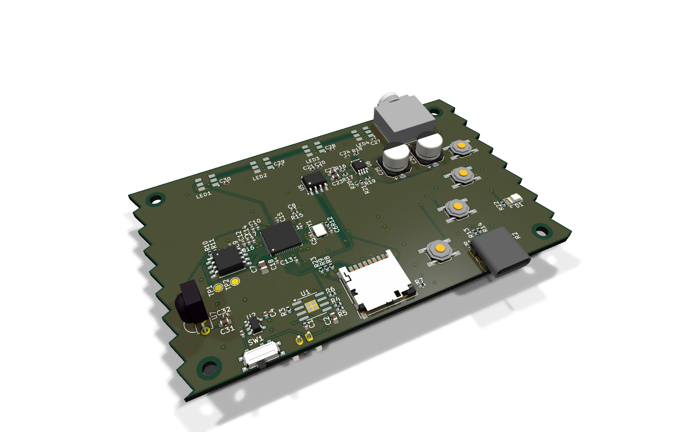
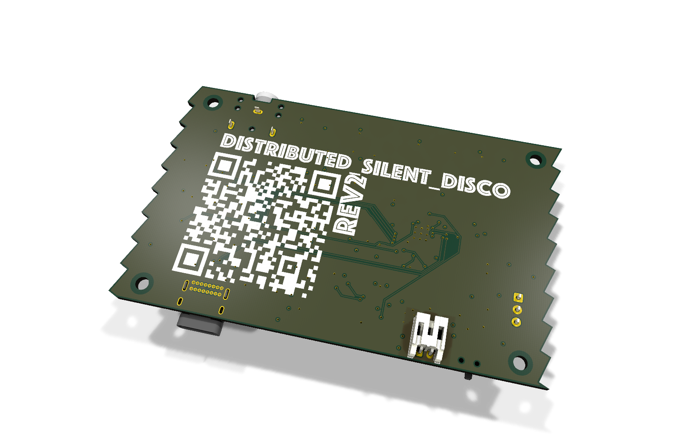

# DEF CON Silent Disco Badge

An RP2040 wearable that turns a crowd into a **silent disco**: each badge
streams MP3 "channels" from its microSD to your headphones, runs a
per-track LED light show, and can **sync channel + playback position to a
neighbouring badge over infrared** — press one button, touch badges
together, and you're dancing to the same beat, lights flashing in step.



## You're holding one?

- **Headphones** in the top jack. **Power switch** on the edge.
- **CHANNEL** — next channel (each channel is one DJ mix, looping forever).
  Hold it **10 seconds** for a hard reset.
- **VOL+ / VOL−** — eight steps; bottom is true mute. Hold to ramp.
- **SYNC** — join a neighbour: your music pauses, the badge listens for
  another badge's IR broadcast (~25 s), then jumps to **their channel at
  their position**. Interlock the sawtooth edges for a guaranteed link —
  that's what the jagged sides are for. When it locks, both badges shimmer.
- **LEDs blinking red?** That's an error code, binary, leftmost LED = 1:
  **1** no SD card · **2** card empty · **3** card unreadable · **4**
  playback failing.
- **Sounds like a modem, or the card "disappears"? Swap the battery.**
  A dying cell warps the audio and breaks the SD card before it kills the
  badge — it looks exactly like a software bug and it never is.

Every badge broadcasts its channel + timecode over IR every 7–13 s, so any
badge can join any other at any time. Synced badges' light shows stay
frame-locked because animations are a pure function of the *track clock*,
not a local timer.

## The hardware

86 × 54 mm credit-card badge, 4-layer, USB-C. Sawtooth left/right edges
interlock badge-to-badge and align each badge's IR emitter with its
neighbour's receiver. Mecha Tokyo dance party silkscreen.

- **MCU:** RP2040 + QSPI flash + 12 MHz crystal — running MicroPython with
  a native (Helix) MP3 decoder C module at a 276 MHz overclock
- **Audio:** microSD → TM8211 I²S DAC → TDA1308 headphone amp → 3.5 mm jack
- **LEDs:** 4× SK9822 addressable RGB across the top edge
- **IR:** TSOP4838 receiver in a left-edge notch, 940 nm emitter on a
  right-edge tooth — NEC-style frames carry (timecode, channel)
- **Power:** battery (JST) → switch → 3.3 V LDO; charger on USB-C
- **SAO connector** with two ADC-capable GPIOs (see the battery-monitor
  bodge in [`firmware/README.md`](firmware/README.md))

Fab outputs for rev 2 are in
[`defcon_badge/fab_rev2.zip`](defcon_badge/fab_rev2.zip) (gerbers, drill,
placement) — the KiCad sources live in [`defcon_badge/`](defcon_badge/).



## The firmware

**[`firmware/README.md`](firmware/README.md)** is the full story. The
short version: MicroPython + a fixed-point C MP3 decoder, an async player
with byte-offset CBR seeking (that's what makes IR time-sync possible), an
edge-captured hard-IRQ IR receiver that survives 60 Hz ambient light, 16
LED themes × 12 animations locked to the playback clock, crash persistence
to internal flash, and a 44-check host-side regression suite that runs the
real firmware modules on a laptop.

Some engineering war stories are preserved in the commit history and
[`firmware/BADGE.md`](firmware/BADGE.md), including:

- the manufacturing run split between two QSPI flash vendors, fixed with a
  **custom boot2** whose continuous-read mode byte satisfies both
- the missing DAC reconstruction filter, diagnosed with a tacked-on
  capacitor and a button-driven audio lab
- why no LED animation ever crossfades (mid-range PWM couples into the
  audio), and how orange and purple exist anyway (your eye blends
  adjacent LEDs)
- the IR link that failed until the pulses became NEC-standard and the
  receive IRQ became a hard IRQ

## Build / hack on it

```sh
cd firmware
python3 tools/host_tests.py        # run the suite (no hardware needed)
tools/flash_badge.sh               # provision a badge end-to-end
tools/prepare_card.sh /Volumes/SD  mix1.wav mix2.flac   # make a card
```

Rebuilding the firmware UF2 (`tools/build_firmware.sh`) fetches
MicroPython, the pico-sdk and the Helix MP3 decoder
([picomp3lib](https://github.com/ikjordan/picomp3lib), RealNetworks
RPSL/RCSL licence) at build time. Demo cards carry Creative
Commons-licensed mixes with attribution in `CREDITS.txt` on the card.

## License

MIT — see [LICENSE](LICENSE). Board art, sawtooth geometry and firmware
all live here; go make a dance floor.
